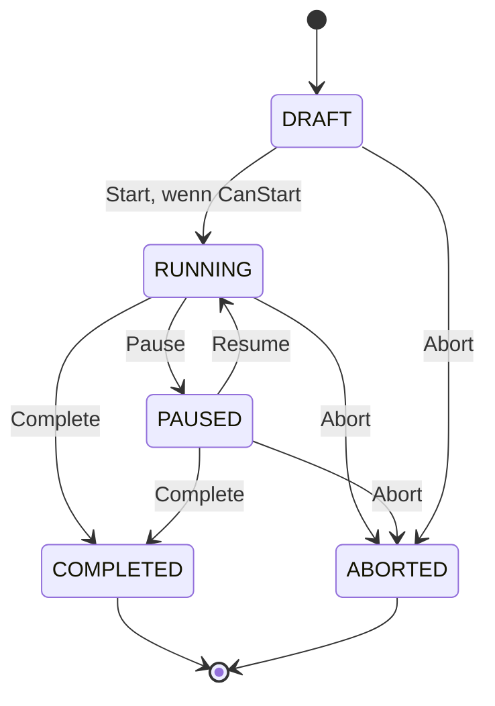

# Persona Simulation Playground

## Arbeitspaket 3A: Aggregate- und Domainverträge

**Status:** REVIEW DRAFT  
**Version:** 1.0  
**Datum:** 2026-08-16  
**Zweck:** Umfassende fachliche Grundlage vor der ersten Modellierung im Code

## 1. Verbindliche Modellierungsprinzipien

1. Alle echten fachlichen MVP-Aggregate werden eventgesourct.
2. `Session`, `Persona`, `Scenario` und `PersonaRelationship` besitzen jeweils einen eigenen Aggregate Event Stream.
3. Read Models sind keine Aggregate und keine Source of Truth.
4. Session-Snapshots sind verwerfbare Performanceartefakte.
5. Eine Session bindet konkrete immutable Persona- und Scenario-Versionen.
6. Der Human ist ein eigener Actor und keine Persona.
7. LLM-Ausgaben sind Vorschläge in Form einer `ParticipantAction`, keine Domain Events.
8. Operationaler Turn-, Retry- und Recovery-State gehört nicht in den Session Event Stream.
9. Eine laufende oder pausierte Session mutiert keine globalen Persona- oder Relationship-Daten.
10. Alle Aggregateoperationen sind unabhängig vom UI und von einer Browserverbindung.

## 2. Aggregate Map

| Aggregate | Persistenz | Verantwortung | Nicht verantwortlich für |
|---|---|---|---|
| `Persona` | Event Sourcing | Identität, Versionserzeugung, Archivierung | Sessionzustand, Inference, Relationship-Dynamik |
| `Scenario` | Event Sourcing | Szenarioidentität, Versionserzeugung, Archivierung | laufende Scenario Events |
| `PersonaRelationship` | Event Sourcing | gerichtete globale Baseline | sessionbezogene Beziehungsänderungen |
| `InteractionModeDefinition` | Event Sourcing nur bei nutzerverwalteter Persistenz; sonst Code/Konfiguration | Mode-Code und versionierte Konfiguration | Ausführung der Mode-Strategie |
| `Session` | Event Sourcing | vollständiger fachlicher Zustand einer Simulation | technische Queue, Inference Request, Projection State |

## 3. Gemeinsame taktische Typen

Alle fachlichen IDs sind starke Typen auf Grundlage von `DDD.BuildingBlocks`:

```text
PersonaId
PersonaVersionId
ScenarioId
ScenarioVersionId
PersonaRelationshipId
InteractionModeDefinitionId
SessionId
ParticipantId
SessionEventId
TurnId
```

IDs werden nicht über fachlich untypisierte Strings oder GUIDs zwischen Domainoperationen ausgetauscht.

Zentrale Value Objects:

```text
PersonaName
VersionNumber
TraitValue
PsychologicalProfile
CommunicationProfile
RelationshipProfile
RuntimeLimits
TokenBudgetPolicy
InteractionModeSelection
SessionTopic
MessageContent
ScenarioEventDescription
SessionActor
CompletionReason
AbortReason
```

## 4. Persona Aggregate

### 4.1 Verantwortung

`Persona` repräsentiert die langfristige Identität einer wiederverwendbaren simulierten Person und verwaltet deren immutable Versionen.

### 4.2 Zustand

```text
PersonaId
Name
PersonaType
CurrentVersionNumber
Archived
Versions
```

`PersonaType`:

```text
Original
Archetype
HistoricalSimulation
FictionalSimulation
```

### 4.3 PersonaVersion

`PersonaVersion` ist eine immutable Entity innerhalb des Aggregate.

```text
PersonaVersionId
VersionNumber
DisplayName
ShortDescription
Background
Role
Interests
Expertise
Goals
Beliefs
Preferences
Dislikes
CommunicationProfile
PsychologicalProfile
AdditionalInstructions
CreatedAt
```

### 4.4 Invariants

- Eine Persona besitzt mindestens eine Version.
- Versionsnummern steigen streng monoton.
- Eine gespeicherte Version wird nicht inhaltlich geändert.
- Bearbeitung erzeugt eine neue Version.
- `CurrentVersionNumber` verweist auf die höchste gültige Version.
- Archivierung löscht weder Persona noch Versionen.
- Historische und fiktionale Simulationen werden als solche typisiert.
- Traitwerte liegen im gültigen Intervall.
- Pflichtfelder sind nach fachlicher Normalisierung nicht leer.
- Archivierte Personas dürfen nicht neu zu Sessions hinzugefügt werden. Bereits referenzierte Versionen bleiben gültig.

### 4.5 Erlaubte Operationen

```text
CreatePersona
CreateNewPersonaVersion
ArchivePersona
RestorePersona optional SHOULD
```

### 4.6 Persistenzkonsequenz

Das Aggregate besitzt einen eigenen Event Stream. Optimistic Concurrency erfolgt über dessen Expected Stream Version. `PersonaVersionCreated` darf die vollständige immutable Version als fachlich grobkörnigen Payload enthalten; einzelne Profilfelder benötigen keine künstlich kleinteiligen Events.

## 5. Scenario Aggregate

### 5.1 Verantwortung

`Scenario` verwaltet eine wiederverwendbare, versionierte Beschreibung der simulierten Situation.

### 5.2 Zustand

```text
ScenarioId
Name
CurrentVersionNumber
Archived
Versions
```

`ScenarioVersion`:

```text
ScenarioVersionId
VersionNumber
Title
Description
Environment
InitialSituation
Topic optional
SocialRules
KnownFacts
TemporalContext optional
AdditionalRules
CreatedAt
```

### 5.3 Invariants

- Eine gespeicherte Scenario-Version ist immutable.
- Bearbeitung erzeugt eine neue Version.
- Archivierung entfernt keine historisch referenzierte Version.
- Eine Session bindet genau eine konkrete Scenario-Version.
- Nach Session-Start kann die Referenz nicht gewechselt werden.
- Laufende Scenario Events verändern nicht die globale Scenario-Version.

## 6. PersonaRelationship Aggregate

### 6.1 Verantwortung

Das Aggregate verwaltet eine gerichtete globale Baseline von einer Persona zu einer anderen.

```text
SourcePersonaId
TargetPersonaId
RelationshipType optional
Affinity
Trust
Respect
Conflict
Familiarity optional
SocialCloseness optional
Dominance optional
Background
StreamVersion, technisch aus dem Aggregate Stream abgeleitet
Archived
```

### 6.2 Invariants

- Source und Target müssen verschieden sein.
- `(SourcePersonaId, TargetPersonaId)` ist eindeutig.
- A nach B ist unabhängig von B nach A.
- Werte liegen in ihren definierten Intervallen.
- Fehlt eine Baseline, wird beim Sessionaufbau ein neutraler Default verwendet.
- Sessionveränderungen werden im MVP niemals automatisch zurückgeschrieben.

## 7. InteractionModeDefinition

### 7.1 Verantwortung

Die Definition bindet einen stabilen Mode-Code an eine versionierte Konfiguration.

```text
InteractionModeDefinitionId
ModeCode
DefinitionVersion
Configuration
Archived
```

Für den MVP existiert produktiv ausschließlich:

```text
ModeCode = FreeSociety
```

Ein Testmodus darf zur Prüfung des Erweiterungspunkts existieren, ist aber keine zweite Produktfunktion.

### 7.2 Invariants

- Mode-Code und Konfigurationsschema sind registriert.
- Eine Session bindet eine konkrete Definition beziehungsweise Konfigurationsversion.
- Nach Session-Start ist kein Mode-Wechsel erlaubt.
- Mode-spezifischer Zustand wird typisiert im Session Aggregate geführt.

## 8. Session Aggregate

### 8.1 Verantwortung

`Session` ist die autoritative fachliche Repräsentation einer konkreten Simulation.

Es schützt:

- Konfiguration und Startfähigkeit;
- Lifecycle;
- Teilnehmerbestand und Presence;
- sessionbezogene Teilnehmerzustände;
- sessionbezogene gerichtete Beziehungen;
- akzeptierte Human- und Participant-Handlungen;
- eingetretene Scenario Events;
- mode-spezifischen Domain State;
- fachliche Limits und Completion.

### 8.2 Rekonstruierter Zustand

```text
SessionId
LifecycleState
ScenarioVersionId optional vor Konfiguration
InteractionModeDefinitionId optional vor Konfiguration
Participants
SessionRelationships
RuntimeLimits
TokenBudgetPolicy
Topic optional
InteractionModeState
TurnCount
EventCount
CreatedAt
StartedAt optional
EndedAt optional
```

Nicht enthalten:

```text
vollständige Eventliste
Read Models
Projection Checkpoints
Inference Request und Response
Prompt
Tokenmetriken
Retry State
Runtime Queue
Browser-/SSE-Verbindungen
RecoveryRequired
```

## 9. Entscheidung zur Session-State-Machine

`READY` wird **nicht als persistierter Lifecycle State** geführt. Startfähigkeit ist das berechnete Prädikat `CanStart`.

Begründung:

- Readiness ist vollständig aus Konfiguration und Mode-Regeln ableitbar;
- Konfigurationsänderungen würden sonst künstliche Ready/Draft-Events erzeugen;
- ein eigener Zustand hätte keine unabhängige fachliche Historie;
- UI kann `CanStart` direkt aus einem Read Model anzeigen.

Persistierte States:

```text
DRAFT
RUNNING
PAUSED
COMPLETED
ABORTED
```



Technische Fehler erzeugen keinen sechsten Domainstate. `RecoveryRequired` bleibt operational.

## 10. `CanStart` Invariant

`CanStart` ist wahr, wenn mindestens:

- State ist `DRAFT`;
- konkrete Scenario-Version ist gesetzt;
- konkrete Interaction-Mode-Definition ist gesetzt;
- mindestens ein Participant vorhanden ist;
- alle Participants referenzieren gültige Persona-Versionen;
- keine Persona ist doppelt vertreten;
- Runtime Limits sind gültig;
- Token Budget Policy ist gültig;
- Mode-spezifische Konfigurationsprüfung ist erfolgreich.

Für das MVP-Abnahmeszenario werden drei Participants verlangt. Die allgemeine Domain-Invariant bleibt zunächst `mindestens eins`, sofern FreeSociety keine höhere Untergrenze festlegt. Die Drei-Persona-Anforderung ist ein Abnahmekriterium, keine universelle Aggregate-Regel.

## 11. Participant Entity

```text
ParticipantId
PersonaId
PersonaVersionId
Presence
Mood optional
Focus optional
ShortTermGoal optional
ActivationState
TurnCount
LastSpokeAtEventVersion optional
```

### Invariants

- Participant gehört genau zu einer Session.
- Persona-Version wird beim Hinzufügen fixiert.
- Pro Session darf dieselbe Persona im MVP nur einmal vorkommen.
- Participant-ID ist innerhalb der Session eindeutig.
- Nach Start darf ein Participant nicht auf eine andere Persona-Version wechseln.
- `Leave` und `Enter` verändern Presence, löschen den Participant aber nicht.
- Entfernen ist Konfigurationsänderung und nur in `DRAFT` erlaubt.
- Ein abwesender Participant darf nicht sprechen oder reagieren.

## 12. SessionRelationship Entity/Value Object

Schlüssel:

```text
(SourceParticipantId, TargetParticipantId)
```

Zustand:

```text
Affinity
Trust
Respect
Conflict
Summary optional
```

### Invariants

- Source und Target sind verschieden und existieren in der Session.
- Beziehungen sind gerichtet.
- Beim Hinzufügen werden relevante Baselines kopiert oder neutrale Defaults erzeugt.
- Änderungen erfolgen nur durch Session-Domainoperationen und Events.
- Für den MVP dürfen Werte nach Initialisierung zunächst statisch bleiben.

## 13. FreeSociety Mode State

Der MVP-State bleibt minimal:

```text
IdleImpulseCount
LastSelectedParticipantId optional
ConsecutiveTurnsBySameParticipant
```

Scores, Candidate-Listen, Zufallswerte und Selection Trace sind operational beziehungsweise Read-/Debug-Daten. Sie sind nur dann Domain State, wenn eine spätere fachliche Regel sie für Entscheidungen über zukünftige gültige Zustände benötigt.

## 14. Session Lifecycle Invariants

### DRAFT

Erlaubt:

- Scenario und Mode wählen;
- Limits konfigurieren;
- Participant hinzufügen oder entfernen;
- Session abbrechen;
- Start bei `CanStart`.

Nicht erlaubt:

- Participant Action anwenden;
- Human Message als Simulationsereignis aufnehmen;
- Scenario Event als laufendes Ereignis injizieren;
- Pause oder Resume.

### RUNNING

Erlaubt:

- gültige Participant Action anwenden;
- Human Message aufnehmen;
- Scenario Event injizieren;
- Pause, Complete oder Abort;
- fachlich erlaubte Enter-/Leave-Actions.

Nicht erlaubt:

- Persona-Version, Scenario-Version oder Mode wechseln;
- Participant konfigurativ entfernen;
- Start oder Resume.

### PAUSED

Erlaubt:

- beobachten und abfragen;
- Resume, Complete oder Abort;
- administrative Recoveryhandlungen außerhalb der Domain.

Für MVP nicht erlaubt:

- neue autonome Participant Actions;
- Human Message oder Scenario Event, solange nicht ausdrücklich als vorbereitete Eingabe modelliert.

### COMPLETED und ABORTED

Terminal. Keine weiteren Simulationsereignisse. Query, Export, Replay und Projection Rebuild bleiben möglich.

## 15. Human Actor

Der Human wird durch `SessionActor.Human` repräsentiert. Er besitzt keine Persona-Version und keinen Participant State.

Human-Eingaben werden getrennt:

- `SubmitHumanMessage` erzeugt eine sichtbare Äußerung in der Simulation;
- Lifecycle Commands steuern die Session, erzeugen aber keine künstliche Chatnachricht;
- `InjectScenarioEvent` erzeugt ein Weltereignis mit Human als auslösendem Actor.

## 16. ParticipantAction

`ParticipantAction` ist ein typisierter Vorschlag aus der Application-Schicht:

```text
Speak
React
Enter
Leave
DoNothing
```

Es ist kein Aggregate, keine Entity und kein Event.

Mapping:

| Action | Domainprüfung | Ergebnis |
|---|---|---|
| `Speak` | Participant anwesend, Content gültig, Target optional gültig | `ParticipantSpoke` |
| `React` | Participant anwesend, Target Event sichtbar und ReactionType erlaubt | `ParticipantReacted` |
| `Enter` | Participant abwesend, Mode erlaubt Eintritt | `ParticipantEntered` |
| `Leave` | Participant anwesend, Mode erlaubt Verlassen | `ParticipantLeft` |
| `DoNothing` | immer als gültige Action behandelbar | kein Domain Event, Turn operational erfolgreich |

## 17. Fachliche Limits

`RuntimeLimits` enthält nur fachlich wirksame Begrenzungen:

```text
MaxTurns
MaxEvents optional
MaxConsecutiveTurnsPerParticipant
MaxIdleImpulses
```

Technische Werte wie HTTP Timeout, Retry Count oder Connection Pool Size gehören nicht hinein.

Tokenbudget wird über eine Domain-nahe Policy-Referenz beschrieben. Die konkrete Tokenzählung bleibt Application/Infrastructure.

## 18. Single-Active-Session-Policy

Genau eine autonom aktive Session ist eine Application-/Runtime-Invariant über mehrere Aggregate, keine interne Invariant eines einzelnen Session Aggregates.

Folge:

- jede Session kennt nur ihren eigenen Zustand;
- keine statische globale `CurrentSession` in der Domain;
- der Application Service koordiniert Start/Resume atomar gegen eine persistierte Runtime-Lease beziehungsweise Active-Session-Guard;
- mehrere Tabs erhalten bei Konflikten eine explizite Ablehnung.

## 19. Referenzintegrität und historische Stabilität

- Persona- und Scenario-Versionen werden nicht hart gelöscht, solange Sessions darauf verweisen.
- Eine Session speichert die IDs der konkreten Versionen.
- Für Replay relevante Mode-Konfiguration muss historisch verfügbar bleiben.
- Anzeigenamen, Avatare und UI-Daten werden nicht redundant in jedes Event kopiert.
- Wenn eine referenzierte Version archiviert ist, bleibt historische Auflösung möglich.

## 20. Domainfehlerkategorien

```text
ValidationFailure
InvariantViolation
InvalidLifecycleTransition
ReferenceNotFound
DuplicateParticipant
ParticipantNotEligible
ActionNotAllowed
ConcurrencyConflict
AlreadyExists
ArchivedReference
```

Technische Fehler wie PostgreSQL- oder vLLM-Ausfall sind keine Domainfehler.

## 21. Modellierungsfragen für Phase 3C

Diese Punkte werden bewusst erst mit ausführbarem Modell und Tests finalisiert:

- exakte Collection-Implementierung innerhalb von `Session`;
- ob Relationship State Entity oder Value Object Collection wird;
- ob `ParticipantReacted` bereits im ersten vertikalen Slice benötigt wird;
- ob Human Messages in `PAUSED` zugelassen oder als vorbereitete Inputs geführt werden;
- ab wann Snapshots messbar nötig sind;
- ob `MaxEvents` zusätzlich zu `MaxTurns` fachlich notwendig ist;
- genaue neutrale Werte für Relationship-Dimensionen.

Diese Fragen blockieren die Vertragsebene nicht.

## 22. Abnahmekriterien für 3A

- Aggregate-Grenzen sind eindeutig.
- Event Sourcing gilt einheitlich für alle fachlichen Aggregate und bleibt von technischer Persistenz getrennt.
- Source of Truth ist pro Aggregate festgelegt.
- Session Lifecycle ist widerspruchsfrei.
- `READY` ist bewusst als `CanStart` entschieden.
- Domain und operationaler State sind getrennt.
- Human, Participant und LLM-Verantwortung sind getrennt.
- Single-Active-Session ist korrekt außerhalb eines einzelnen Aggregates verortet.
- Offene Implementierungsdetails sind explizit nach 3C verschoben.
