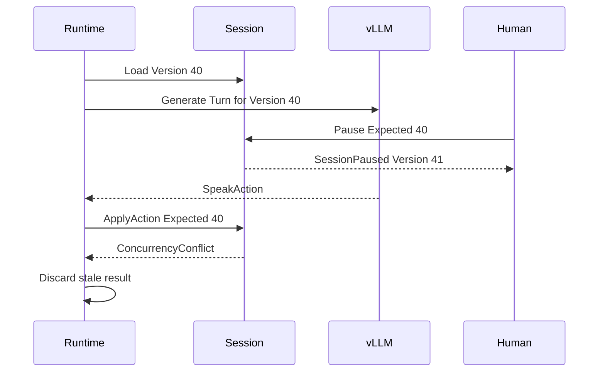

# Persona Simulation Playground

## Arbeitspaket 3B: Command- und Eventverträge

**Status:** REVIEW DRAFT  
**Version:** 1.0  
**Datum:** 2026-08-16  
**Hinweis:** Semantisch verbindlicher Entwurf, C#-Skizzen sind absichtlich nicht implementierungsgenau

## 1. Vertragsprinzipien

- Commands formulieren einen Änderungswunsch.
- Ein abgelehnter Command erzeugt kein Domain Event.
- Domain Events formulieren akzeptierte Tatsachen in Vergangenheitsform.
- Session Events werden ausschließlich über das Session Aggregate erzeugt.
- Ein erfolgreicher Append ist der fachliche Commit.
- Events sind immutable.
- Eventpayload und technische Metadaten sind getrennt.
- Commands gegen bestehende Sessions tragen `ExpectedVersion`.
- Wiederholte Zustellung desselben Commands darf nicht zu doppelten Events führen.

## 2. Gemeinsamer Command Envelope

```text
CommandId
CommandType
IssuedAt
Actor
CorrelationId
CausationId optional
AggregateId optional bei Create
ExpectedVersion optional
Payload
```

`ExpectedVersion`:

- bei Create: `NoStream`;
- bei Mutation einer Session: verpflichtend;
- bei jeder Mutation eines bestehenden fachlichen Aggregates: erwartete Stream Version.

## 3. Gemeinsamer Event Envelope

```text
EventId
AggregateId
AggregateType
StreamVersion
GlobalPosition
EventType
SchemaVersion
OccurredAt
CommittedAt
CorrelationId
CausationId
CommandId optional
TurnId optional
Actor optional
Payload
```

`StreamVersion` und `GlobalPosition` sind verschieden:

- StreamVersion ordnet Events eines Aggregates;
- GlobalPosition ordnet committed Events für Projektionen.

## 4. Commands und Events der verwalteten Domain Aggregate

### CreatePersona

**Input:** `PersonaId`, `Name`, `PersonaType`, initiale `PersonaVersionDraft`  
**Vorbedingungen:** ID und Name noch nicht belegt, Draft gültig  
**Ergebnis:** Persona mit Version 1  
**Fehler:** AlreadyExists, ValidationFailure

### CreateNewPersonaVersion

**Input:** `PersonaId`, `ExpectedVersion`, `PersonaVersionDraft`  
**Vorbedingungen:** Persona existiert und ist nicht archiviert  
**Ergebnis:** `PersonaVersionCreated` mit vollständiger immutable Version; neue CurrentVersion wird beim Apply abgeleitet  
**Fehler:** ReferenceNotFound, ArchivedReference, ConcurrencyConflict, ValidationFailure

### ArchivePersona

**Input:** `PersonaId`, `ExpectedVersion`  
**Ergebnis:** `PersonaArchived`; Versionen bleiben über den Stream rekonstruierbar

### CreateScenario / CreateNewScenarioVersion / ArchiveScenario

Entsprechen semantisch den Persona-Commands mit scenario-spezifischen Payloads.

### SetPersonaRelationshipBaseline

**Input:** Source, Target, `ExpectedVersion` beziehungsweise `NoStream` bei Neuanlage, RelationshipProfile, Background  
**Vorbedingungen:** beide Personas existieren, Source ungleich Target  
**Ergebnis:** `PersonaRelationshipEstablished` oder `PersonaRelationshipBaselineChanged`

## 5. Session Commands

### CreateSession

**Input:** `SessionId`, optionaler Name, `Actor`  
**ExpectedVersion:** `NoStream`  
**Ergebnis:** `SessionCreated`  
**State danach:** `DRAFT`

### ConfigureSession

**Input:** `SessionId`, `ExpectedVersion`, `ScenarioVersionId`, `InteractionModeDefinitionId`, `RuntimeLimits`, `TokenBudgetPolicy`, optionales Topic  
**Vorbedingungen:** State `DRAFT`, Referenzen gültig, Konfiguration gültig  
**Ergebnis:** `SessionConfigured`

Dieser Command ersetzt die komplette konfigurierbare Sessionbasis atomar. Feingranulare UI-Edits können später auf denselben Use Case gemappt werden.

### AddParticipant

**Input:** `SessionId`, `ExpectedVersion`, `ParticipantId`, `PersonaId`, `PersonaVersionId`  
**Vorbedingungen:** State `DRAFT`, Persona-Version gültig, Persona nicht bereits enthalten  
**Ergebnis:** `ParticipantAdded` einschließlich initialer Relationship-Zustände, soweit dafür ein gemeinsames Event genügt

### RemoveParticipant

**Input:** `SessionId`, `ExpectedVersion`, `ParticipantId`  
**Vorbedingungen:** State `DRAFT`, Participant vorhanden  
**Ergebnis:** `ParticipantRemoved`

### StartSession

**Input:** `SessionId`, `ExpectedVersion`  
**Vorbedingungen:** State `DRAFT`, `CanStart`, Application-Guard erlaubt diese Session als einzige aktive Session  
**Ergebnis:** `SessionStarted`

### PauseSession

**Input:** `SessionId`, `ExpectedVersion`, optionaler Reason  
**Vorbedingungen:** State `RUNNING`  
**Ergebnis:** `SessionPaused`

### ResumeSession

**Input:** `SessionId`, `ExpectedVersion`  
**Vorbedingungen:** State `PAUSED`, Application-Guard frei  
**Ergebnis:** `SessionResumed`

### CompleteSession

**Input:** `SessionId`, `ExpectedVersion`, `CompletionReason`  
**Vorbedingungen:** State `RUNNING` oder `PAUSED`  
**Ergebnis:** `SessionCompleted`

### AbortSession

**Input:** `SessionId`, `ExpectedVersion`, `AbortReason`  
**Vorbedingungen:** State nicht `COMPLETED` oder `ABORTED`  
**Ergebnis:** `SessionAborted`

### SubmitHumanMessage

**Input:** `SessionId`, `ExpectedVersion`, `MessageContent`, optionales TargetParticipantId  
**Vorbedingungen:** State `RUNNING`, Target gültig  
**Ergebnis:** `HumanSpoke`

### InjectScenarioEvent

**Input:** `SessionId`, `ExpectedVersion`, `ScenarioEventDescription`, optionale strukturierte Tags  
**Vorbedingungen:** State `RUNNING`, Payload gültig  
**Ergebnis:** `ScenarioEventOccurred`

### ApplyParticipantAction

**Input:** `SessionId`, `ExpectedVersion`, `TurnId`, validierte `ParticipantAction`  
**Vorbedingungen:** State `RUNNING`, Turn bezieht sich auf dieselbe ExpectedVersion, Actor und Action sind fachlich zulässig  
**Ergebnisse:**

- `Speak` zu `ParticipantSpoke`;
- `React` zu `ParticipantReacted`;
- `Enter` zu `ParticipantEntered`;
- `Leave` zu `ParticipantLeft`;
- `DoNothing` zu keinem Domain Event.

Bei stale ExpectedVersion wird das Resultat verworfen. Es wird nicht auf den neuen State umgedeutet.

## 6. Session Event Payloads

### SessionCreated, Schema 1

```text
SessionId
Name optional
CreatedAt
```

### SessionConfigured, Schema 1

```text
ScenarioVersionId
InteractionModeDefinitionId
RuntimeLimits
TokenBudgetPolicy
Topic optional
```

### ParticipantAdded, Schema 1

```text
ParticipantId
PersonaId
PersonaVersionId
InitialPresence
InitialParticipantState
InitialRelationships[]
```

Die initialen Relationship-Werte werden in das Event aufgenommen, weil spätere Änderungen globaler Baselines das historische Session-Replay nicht verändern dürfen.

### ParticipantRemoved, Schema 1

```text
ParticipantId
```

### SessionStarted, Schema 1

```text
StartedAt
```

### SessionPaused, Schema 1

```text
PausedAt
Reason optional
```

### SessionResumed, Schema 1

```text
ResumedAt
```

### SessionCompleted, Schema 1

```text
CompletedAt
CompletionReason
```

### SessionAborted, Schema 1

```text
AbortedAt
AbortReason
```

### HumanSpoke, Schema 1

```text
MessageId
Content
TargetParticipantId optional
```

### ParticipantSpoke, Schema 1

```text
MessageId
ParticipantId
TargetParticipantId optional
Content
Intent optional
```

Modelname, Temperatur, Prompt und Tokenzahl gehören nicht in diese Payload. Sie werden über `TurnId` und technische Turn-Metadaten auflösbar gemacht.

### ParticipantReacted, Schema 1

```text
ReactionId
ParticipantId
TargetEventId
ReactionType
```

### ParticipantEntered / ParticipantLeft, Schema 1

```text
ParticipantId
```

### ScenarioEventOccurred, Schema 1

```text
ScenarioEventId
Description
Tags[] optional
```

## 7. Noch nicht notwendige MVP-Events

Folgende Eventtypen werden vorbereitet, aber nicht vorzeitig implementiert:

```text
ParticipantMoodChanged
ParticipantFocusChanged
ParticipantGoalChanged
RelationshipStateChanged
ModePhaseChanged
```

Sie werden erst ergänzt, wenn ein konkreter MVP-Use-Case tatsächlich Zustand verändert. Insbesondere soll nicht nach jeder Äußerung künstlich Mood oder Relationship mutiert werden.

## 8. Fehlerverträge

| Fehler | Bedeutung | HTTP-nahe Abbildung später |
|---|---|---|
| `ValidationFailure` | Payload formal oder fachlich unvollständig | 400 |
| `ReferenceNotFound` | referenzierte Domain-ID fehlt | 404 |
| `InvalidLifecycleTransition` | Command im aktuellen State unzulässig | 409 |
| `ConcurrencyConflict` | ExpectedVersion ist veraltet | 409 |
| `DuplicateParticipant` | Persona bereits in Session | 409 |
| `ActionNotAllowed` | validierte Action verletzt Domain-/Mode-Regel | 422 oder 409 |
| `ArchivedReference` | neue Nutzung archivierter Definition | 409 |
| `AlreadyExists` | Create-ID bereits belegt | 409 |

Die Domain kennt keine HTTP-Statuscodes. Die Tabelle ist nur eine spätere Transportorientierung.

## 9. Idempotenz

- Jeder Command besitzt `CommandId`.
- Der Application-Layer prüft beziehungsweise speichert den Verarbeitungsausgang.
- Derselbe erfolgreich verarbeitete Command liefert denselben bekannten Ausgang und erzeugt keine zweiten Events.
- Ein Event besitzt eine global eindeutige `EventId`.
- Projektionen müssen wiederholte Zustellung desselben Events tolerieren.
- `TurnId` verhindert, dass derselbe Inference Turn mehrfach committed wird.

## 10. Stale Inference Flow



## 11. C#-Skizzen

Diese Beispiele zeigen Semantik, nicht die endgültige Framework-API.

```csharp
public sealed record PauseSession(
    CommandId CommandId,
    SessionId SessionId,
    long ExpectedVersion,
    string? Reason);
```

```csharp
public sealed record ParticipantSpoke(
    MessageId MessageId,
    ParticipantId ParticipantId,
    ParticipantId? TargetParticipantId,
    MessageContent Content,
    string? Intent);
```

```csharp
public void Pause(Instant occurredAt, string? reason)
{
    EnsureState(SessionState.Running);
    Raise(new SessionPaused(occurredAt, reason));
}

private void Apply(SessionPaused e)
{
    State = SessionState.Paused;
}
```

```csharp
public IReadOnlyList<IDomainEvent> Apply(ParticipantAction action)
{
    EnsureRunning();
    return action switch
    {
        SpeakAction speak => AcceptSpeak(speak),
        ReactAction react => AcceptReaction(react),
        EnterAction enter => AcceptEnter(enter),
        LeaveAction leave => AcceptLeave(leave),
        DoNothingAction => [],
        _ => throw new ActionNotAllowed(...)
    };
}
```

## 12. Vollständiges Ablaufbeispiel

```text
1. CreateSession, NoStream
   -> SessionCreated, Version 0

2. ConfigureSession, Expected 0
   -> SessionConfigured, Version 1

3. AddParticipant Herbert, Expected 1
   -> ParticipantAdded, Version 2

4. AddParticipant Gisela, Expected 2
   -> ParticipantAdded, Version 3

5. AddParticipant Spock, Expected 3
   -> ParticipantAdded, Version 4

6. StartSession, Expected 4
   -> SessionStarted, Version 5

7. Runtime plant Turn T-17 auf Version 5
8. vLLM liefert SpeakAction für Gisela
9. Action wird syntaktisch und fachlich validiert
10. ApplyParticipantAction, Expected 5, Turn T-17
    -> ParticipantSpoke, Version 6
11. Eventstore committed
12. Projection liest GlobalPosition
13. Read Model und Checkpoint werden transaktional aktualisiert
14. SSE publiziert erst den committed/projizierten Stand
```

## 13. Offene Punkte für 3C

- endgültige Namen einzelner Frameworkinterfaces;
- genaue Result-Typen der Command Pipeline;
- Wahl von `DateTimeOffset` oder einer `Instant`-Abstraktion;
- ob `React` im ersten Slice oder erst später implementiert wird;
- ob InitialRelationships im `ParticipantAdded` oder in separaten Initialisierungsereignissen liegen. Aktuelle Empfehlung: im `ParticipantAdded`, um Eventrauschen zu vermeiden;
- genaue technische Idempotency-Speicherung.
