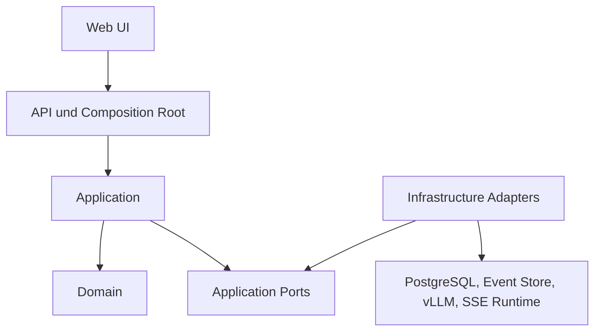

# Persona Simulation Playground

## Arbeitspaket 4A: Application-Komponenten und Verantwortungsgrenzen

**Status:** REVIEW DRAFT  
**Version:** 1.0  
**Datum:** 2026-08-16  
**Zweck:** Konzeptuelle Festlegung der Application-Schicht und ihrer Grenzen

## 1. Ziel und Abstraktionsniveau

Dieses Dokument legt fest:

- welche Application-Komponenten benötigt werden;
- welche Verantwortung jeweils genau einen primären Owner besitzt;
- welche Fähigkeiten als Ports benötigt werden;
- welche Daten zwischen Domain, Application und Infrastructure fließen;
- wo Transaktions-, Concurrency- und Publication-Grenzen liegen;
- welche Entscheidungen bewusst erst während der Implementierung fallen.

Nicht festgelegt werden:

- endgültige C#-Methodensignaturen;
- konkrete Persistence Library;
- konkrete Event-Store-Technologie;
- konkrete DI-Registrierung;
- konkrete REST-Endpunkte;
- Tabellen- und Schemaentwürfe;
- eine generische Plugin-Plattform.

## 2. Schichtenmodell



Abhängigkeitsrichtung:

```text
API -> Application -> Domain
Infrastructure -> Application Ports
Domain -> DDD.BuildingBlocks tactical core
```

Die Domain kennt keine Application Services, keine Infrastrukturprovider und keine UI-Verträge.

## 3. Grundsatz: Use Cases statt technische Workflows

Die Application-Schicht koordiniert fachliche Anwendungsfälle. Sie darf dafür:

- Aggregate laden;
- Domainoperationen aufrufen;
- Domainresultate persistieren;
- externe Inference anstoßen;
- Runtime-Schritte koordinieren;
- Read Models abfragen;
- committed Änderungen für UI und Background-Verarbeitung verfügbar machen.

Sie darf nicht:

- Domain-Invariants duplizieren;
- Eventpayloads anstelle des Aggregates erfinden;
- LLM-Output ungeprüft persistieren;
- UI-State als fachliche Wahrheit verwenden;
- einen Datenbankprovider oder vLLM-spezifische DTOs in die Domain tragen;
- über einen lang laufenden Inference-Aufruf eine Datenbanktransaktion oder Aggregate-Sperre halten.

## 4. Komponentenübersicht

| Komponente | Schicht | Primäre Verantwortung | Darf verwenden | Darf nicht entscheiden |
|---|---|---|---|---|
| Persona Use Cases | Application | Persona anlegen, neue Version koordinieren, archivieren | Persona-Aggregate, Event-Stream-Persistenz | Persona-Invariants umgehen |
| Scenario Use Cases | Application | Scenario-Lifecycle und Versionierung koordinieren | Scenario-Aggregate, Event-Stream-Persistenz | laufende Session mutieren |
| Relationship Use Cases | Application | globale Baselines pflegen | Relationship-Aggregate, Persistenz | Sessionbeziehungen automatisch konsolidieren |
| Session Command Service | Application | Session Commands laden, ausführen und committen | Session Store, Domain | Mode-/Domainregeln nachbauen |
| SessionOrchestrator | Application | genau einen nachvollziehbaren Runtime-Impuls koordinieren | Mode, Auswahl, Context, Decision, Runtime Ports | Inhalt einer Persona erfinden |
| Runtime Coordinator | Application | Active-Session-Guard, Impulsplanung, Step/Auto, Backpressure | Turn Store, Queue, Clock | Domainzustand besitzen |
| IInteractionMode | Application mit Domainverträgen | Mode-Regeln, Allowed Actions, Eligibility, Completion | Domain Snapshot/View, Policies | Persistenz oder Inference ausführen |
| InteractionModeRegistry | Application | Mode-Code auf konkrete Strategie auflösen | registrierte Modes | beliebigen Benutzercode laden |
| ParticipantSelectionPolicy | Application | aus eligiblen Kandidaten WHO bestimmen | Selection Context, Random Source | Äußerung erzeugen |
| ParticipantDecisionService | Application | WHAT und HOW für ausgewählten Participant ermitteln | Context Builder, Inference Client | Action endgültig akzeptieren |
| ContextBuilder | Application | rekonstruierbaren Request Context erzeugen | Query Ports, Renderer, Token Counter | Domain State verändern |
| ParticipantActionParser | Application/Infrastructure-Grenze | Providerantwort in typisierte Action überführen | Inference DTO | Domainregeln entscheiden |
| ParticipantActionValidator | Application plus Domain | syntaktische Vorprüfung und Aufruf der Domainvalidierung | Action, Mode, Session | Eventstore direkt schreiben |
| Projection Dispatcher | Application/Framework Runtime | committed Events an Projektionen zustellen | Event Feed, Checkpoints | Domain Commit rückgängig machen |
| Query Services | Application | Read Models für API bereitstellen | Read Store | Aggregate als Read Model verwenden |
| Live Update Coordinator | Application | committed/projizierte Änderungen publizierbar machen | Projection Result, Live Port | SSE-Verbindung besitzen |

## 5. Persona-, Scenario- und Relationship-Use-Cases

Diese Use Cases sind bewusst einfach. Sie koordinieren eigenständige event-sourced Aggregate und deren Stream-Versionen.

Gemeinsamer Ablauf:

```text
Request validieren
Aggregate laden oder erzeugen
Domainoperation aufrufen
neue Events mit Expected Stream Version anhängen
Read Side aktualisieren oder Änderung publizierbar machen
Result zurückgeben
```

Die Application-Schicht erzeugt keine mutable Version aus einer bestehenden Version. Die Domainoperation erzeugt eine neue immutable Version.

## 6. Session Command Service

Der Session Command Service ist der allgemeine Owner für direkte Commands gegen das `Session` Aggregate.

Beispiele:

```text
CreateSession
ConfigureSession
AddParticipant
StartSession
PauseSession
ResumeSession
CompleteSession
AbortSession
SubmitHumanMessage
InjectScenarioEvent
ApplyParticipantAction
```

Verantwortung:

1. Command und Actor-Kontext annehmen.
2. Idempotency prüfen.
3. Session mit erwarteter Version laden.
4. notwendige Referenzen über Application Ports auflösen.
5. Domainoperation ausführen.
6. neue Events atomar appendieren.
7. Commitresultat zurückgeben.

Der Service mapped keine LLM-Rohantwort direkt auf Events. Er akzeptiert nur eine bereits typisierte Action und lässt das Aggregate die letzte fachliche Entscheidung treffen.

## 7. SessionOrchestrator

### 7.1 Verantwortung

Der Orchestrator bearbeitet genau einen diskreten Runtime-Impuls.

Er entscheidet auf hoher Ebene:

- ob die Session einen autonomen Schritt ausführen darf;
- ob ein priorisierter Human-/Admin-Impuls vorliegt;
- ob der Interaction Mode einen Übergang oder Abschluss verlangt;
- ob ein Participant ausgewählt werden soll;
- ob Inference benötigt wird;
- ob ein weiterer Impuls geplant werden darf.

### 7.2 Kein Endlosloop

Der Orchestrator ruft sich nicht rekursiv auf und besitzt keine unkontrollierte Schleife.

```text
RuntimeImpulse
  -> Session laden
  -> nächsten zulässigen Schritt bestimmen
  -> höchstens eine fachlich relevante Operation ausführen
  -> optional genau einen Folgeimpuls planen
  -> Ende
```

### 7.3 Was er nicht tut

- keine hart codierte FreeSociety-Sprecherwahl;
- kein Prompt-Rendering;
- kein direkter HTTP-Aufruf;
- kein Eventstore-SQL;
- kein Parsen von vLLM-JSON;
- kein Erfinden von Participant Actions;
- keine Projektion;
- keine SSE-Verbindungsverwaltung.

## 8. Runtime Coordinator

Der Runtime Coordinator besitzt operationalen, nicht fachlichen Zustand:

```text
ActiveSessionGuard
PendingRuntimeImpulse
Turn Status
ExpectedSessionVersion
Inference Request Reference
Retry Count
RecoveryRequired
Cancellation State
```

Er garantiert:

- höchstens eine autonom aktive Session;
- höchstens einen globalen Inference-Aufruf;
- keine spekulativen Folgeturns;
- bounded Queue;
- Human- und Admin-Priorität;
- Cancellation bei Pause oder Abort;
- UI-Erreichbarkeit unabhängig von einem Turnfehler;
- kein ungeprüftes Auto-Resume nach Prozessabbruch.

Der Runtime Coordinator ist nicht Source of Truth für den Session Domain State.

## 9. Interaction Mode

`IInteractionMode` ist eine Application-Strategie, die auf Domainkonzepten arbeitet.

Konzeptionelle Fähigkeiten:

```text
ValidateConfiguration
DetermineAllowedActions
DetermineEligibleParticipants
EvaluateTransitionOrCompletion
CreateSelectionContext
ValidateModeSpecificAction
```

Der Mode darf deterministische Domainregeln und Application Policies kombinieren. Er führt selbst keine Persistenz und keine Inference aus.

Für den MVP wird nur `FreeSociety` produktiv ausgeliefert.

## 10. WHO, WHAT und HOW

Die Verantwortungen bleiben getrennt:

| Frage | Owner | Ergebnis |
|---|---|---|
| Darf überhaupt gehandelt werden? | Session + Interaction Mode | Eligibility/Allowed Actions |
| Wer erhält eine Gelegenheit? | Selection Policy | Participant oder Idle |
| Was möchte der Participant tun? | Decision Service plus LLM | typisierte Action |
| Wie wird gesprochen? | LLM innerhalb Persona Context | Content und optional Intent |
| Darf die Action eintreten? | Session Aggregate | Domain Event oder Ablehnung |

Die MVP-Inference darf WHAT und HOW in einem Request verbinden. Die konzeptuelle Trennung bleibt dennoch bestehen.

## 11. ContextBuilder

Der ContextBuilder erhält einen expliziten `TurnContext` und baut daraus einen deterministischen Request.

Inputfamilien:

```text
Session Identity und Version
Scenario Version
Interaction Mode Regeln
Persona Version
gerichtete Relationships aus Sicht des Participants
Participant State
relevanter historischer Kontext
append-only Recent Events
Current Trigger
Allowed Actions
Context Budget
Renderer Version
```

Outputfamilien:

```text
Context Blocks
finaler Inference Request
Token Counts
Truncation/Compaction Decisions
Debug Metadata
```

Der ContextBuilder liest über Query- beziehungsweise History-Ports. Er lädt nicht eigenmächtig Aggregate und schreibt keine Domaindaten.

## 12. ParticipantDecisionService

Der Decision Service koordiniert:

```text
TurnContext
  -> ContextBuilder
  -> InferenceClient
  -> ActionParser
  -> syntaktische Validation
  -> ParticipantAction
```

Er gibt keine Domain Events zurück. Die Action wird anschließend gegen die neu geladene Session und die ursprüngliche ExpectedVersion angewendet.

Fehlerklassen:

- Provider unavailable;
- timeout;
- cancelled;
- invalid structured output;
- unsupported action type;
- token/context limit;
- retry exhausted.

## 13. Action Validation

Validierung erfolgt in zwei Ebenen:

### Application Validation

- strukturierte Antwort parsebar;
- Action Type bekannt;
- IDs und Pflichtfelder formal gültig;
- Content innerhalb technischer Grenzen;
- Response gehört zum erwarteten Turn.

### Domain Validation

- Session ist `RUNNING`;
- Participant existiert und ist anwesend;
- Action ist im Mode erlaubt;
- Target ist fachlich gültig;
- Lifecycle und Invariants erlauben die Änderung.

Nur die Domain erzeugt das Event.

## 14. Persistenz-Portfamilien

### 14.1 Einheitliche Aggregate-Event-Persistenz

Benötigte Fähigkeiten:

```text
Load stream by typed aggregate ID
Rehydrate aggregate
Append with Expected Stream Version
Read committed aggregate version
Resolve immutable referenced version über autoritative Write Side oder geeignete Registry
Existence/reference checks ohne Vertrauen auf möglicherweise verzögerte UI-Projektionen
```

Konzeptuelle Ports können aggregate-spezifisch oder über eine kleine gemeinsame Basis modelliert werden. Eine generische Repository-Hierarchie ist kein Ziel an sich.

### 14.2 Session-spezifische Anforderungen auf derselben Persistenzbasis

Benötigte Fähigkeiten:

```text
Load Session from stream, optional snapshot
Load at current version
Append one or more events with Expected Version
Return committed stream versions and global positions
Read committed stream for replay
Read committed feed for projections
Store/load optional snapshots
```

### 14.3 DDD.BuildingBlocks-Grenzen

`DDD.BuildingBlocks` stellt bereits providerbasierte Interfaces bereit. Diese Fähigkeit wird genutzt.

Zu unterscheiden sind:

- Application benötigt die Fähigkeit, fachliche Aggregate zu laden und deren neue Events atomar anzuhängen;
- das Framework-Repository orchestriert Event Sourcing;
- ein Framework-Storage-Provider bindet die konkrete Event-Store-Technologie an;
- die Domain kennt keinen dieser Ports.

Ob die Application direkt von einem modernisierten, ausreichend sauberen Framework-Repository-Contract abhängt oder dünne aggregatebezogene Application Ports vorgeschaltet werden, wird in 4C anhand des modernisierten Codes entschieden. Bedeutungslose Wrapper werden nicht vorsorglich eingeführt.

## 15. Event-Store-Technologie bleibt offen

Arbeitspaket 4 entscheidet nicht zwischen:

1. eigenem PostgreSQL-Provider auf Basis der `DDD.BuildingBlocks`-Interfaces;
2. Adaption der vorhandenen relationalen Providerlogik für PostgreSQL;
3. externem Event Store mit Adapter auf dieselben benötigten Fähigkeiten.

Verbindlich sind nur Semantiken:

- atomarer Expected-Version-Check;
- geordneter Stream;
- immutable Events;
- stabile Eventtypen und Schema-Versionen;
- global fortsetzbarer Projection Feed;
- idempotente Projektionen;
- Recovery und Rebuild;
- persist-before-publish;
- Snapshot ist optional.

### Präzisierung zur bestehenden PostgreSQL-Entscheidung

PostgreSQL bleibt für Read Models und technische Persistenz gesetzt. Ob die fachlichen Event Streams ebenfalls in PostgreSQL oder in einem externen Event Store liegen, bleibt eine spätere bewusste Infrastrukturentscheidung. Ein PostgreSQL-Provider ist weiterhin die einfachere Ausgangshypothese, aber noch nicht festgeschrieben.

Der unveränderte MSSQL-Provider ist unter der aktuellen PostgreSQL-Zielsetzung keine produktive Option. Seine Logik kann als Referenz dienen oder adaptiert werden.

## 16. Event-Store-Entscheidungsgate

Die konkrete Technologie muss spätestens vor der produktiven Persistenzetappe entschieden werden.

Bewertungskriterien:

| Kriterium | Bedeutung |
|---|---|
| Korrektheit | atomarer Append und Concurrency |
| Projektionen | globaler Feed, Checkpoints, Rebuild |
| Betrieb | Ressourcen, Backup, Restore, Monitoring |
| k3s-Komplexität | zusätzliche Stateful Workloads |
| Framework-Fit | Adapteraufwand zu DDD.BuildingBlocks |
| Migration | Event Schema Evolution und Export |
| Tests | realistische Integrationstests |
| Lock-in | Wechsel ohne Änderung des Domain Models |

Das Default-Votum lautet weiterhin PostgreSQL-Provider, solange eine externe Lösung keinen nachweisbaren Zusatznutzen bietet.

## 17. Weitere Application Ports

### Inference

```text
IInferenceClient
```

Fähigkeit: Einen providerneutralen Inference Request ausführen und ein providerneutrales Resultat liefern.

Nicht im Port:

- vLLM-spezifische HTTP-Header;
- OpenAI-Transportobjekte;
- Retry Policy;
- Domain Events.

### Zeit

```text
IClock
```

Zeitpunkte für Commands, Events und Runtime Timeout-Berechnung. Domain-Apply verwendet persistierte Eventzeiten und liest keine Uhr.

### Zufall

```text
IRandomSource
```

Seedbar für Tests. Die Policy entscheidet, wie Zufall verwendet wird.

### Tokenzählung

```text
ITokenCounter
```

Modell-/Tokenizerabhängige Zählung außerhalb der Domain.

### Runtime Queue und Turn State

```text
IRuntimeImpulseQueue
ITurnStore
IActiveSessionGuard
```

Diese Ports transportieren operationalen Zustand, nicht Domain State.

### Live Publication

```text
ILiveUpdatePublisher
```

Publiziert bereits committed und passend materialisierte Updates. Der Port kennt keine konkrete SSE-Verbindung.

### Read Models

Query Ports liefern zweckgebundene Read DTOs. Sie geben keine Aggregate zurück.

## 18. Projection-Verantwortung

Der Projection Dispatcher:

1. liest committed Events ab Checkpoint;
2. löst passende Projectors auf;
3. wendet ein Event idempotent an;
4. speichert Read-Model-Änderung und Checkpoint zusammen;
5. isoliert Fehler pro Projection;
6. macht erfolgreichen Fortschritt für Live Updates sichtbar.

Eine fehlgeschlagene Projection macht den Domain Commit nicht rückgängig.

Read-Model-Rebuild:

```text
Projection anhalten
Read Model leeren oder neue Version anlegen
Checkpoint zurücksetzen
committed Feed erneut abspielen
umschalten/freigeben
```

## 19. Live Updates und SSE

Die API besitzt SSE-Verbindungen, aber nicht die fachliche Publikationsentscheidung.

```text
Domain Commit
  -> Projection
  -> Checkpoint Commit
  -> Live Update Signal
  -> API/SSE
  -> UI lädt oder übernimmt Read Model
```

Damit sieht das UI keinen Zustand, den seine Query-Seite noch nicht lesen kann.

Temporäre Streaming-Tokens dürfen separat angezeigt werden, sind aber kein Domain Event und kein committed Read Model.

## 20. Transaktionsgrenzen

### Domain Command

Eine Transaktion umfasst den atomaren Event Append mit Expected Version. Sie umfasst nicht:

- vLLM-Aufruf;
- Projection aller Read Models;
- SSE-Auslieferung;
- Snapshot-Erzeugung, sofern diese separat scheitern darf.

### Inference Turn

```text
Session Version N lesen
Turn operational sichern
Transaktion beenden
Inference ausführen
Session erneut laden
Action gegen Expected Version N anwenden
Events atomar appendieren
Turn operational abschließen
```

## 21. Fehler-Ownership

| Fehler | Primärer Owner | Reaktion |
|---|---|---|
| Domain rejection | Domain/Application | verständliche Ablehnung, kein Retry |
| Concurrency conflict | Application | stale Result verwerfen oder Benutzer neu laden lassen |
| Inference timeout | Runtime/Application | begrenzter Retry oder Failed Turn |
| PostgreSQL/Event Store unavailable | Infrastructure/Application | degraded, keine falsche Domainänderung |
| Projection failure | Projection Runtime | Checkpoint nicht vorziehen, später retry |
| SSE disconnect | API | Reconnect ab Cursor, keine Runtimewirkung |
| Invalid structured output | Decision Service | begrenzter Korrekturversuch |
| Process restart mid-turn | Runtime Recovery | `RecoveryRequired`, kein ungeprüftes Resume |

## 22. Daten, die Portgrenzen passieren dürfen

Erlaubt:

- starke Domain IDs;
- immutable Command- und Result-Verträge;
- Domain Events beziehungsweise Event Envelopes an Persistenzgrenzen;
- Application DTOs;
- providerneutrale Inference Requests/Results;
- Read DTOs;
- CancellationToken und technische Deadlines an I/O-Grenzen.

Nicht erlaubt:

- EF Entities in Domain/Application Contracts;
- `DbContext` außerhalb Infrastructure;
- Npgsql-/SQL-Typen;
- vLLM-/OpenAI-Transportobjekte außerhalb des Adapters;
- HTTP-Kontext in Use Cases;
- UI-Komponentenstate;
- versteckte globale Sessionobjekte.

## 23. Bewusst nicht eingeführte Abstraktionen

- generischer `IRepository<T>` für alle Probleme;
- Unit of Work über Inference und Persistenz;
- Event Bus als Voraussetzung innerhalb des Prozesses;
- Message Broker;
- universeller Workflow Engine Port;
- `IEverythingService` für die gesamte Runtime;
- Plugin Loader für externe Mode-Assemblies;
- Domain Service für technische Inference.

## 24. Architekturinvariants für Arbeitspaket 4

1. Jede zentrale Verantwortung besitzt einen primären Owner.
2. Domain enthält keine Infrastrukturports.
3. API bleibt Transport und Composition Root.
4. Application koordiniert, Domain entscheidet.
5. Inference erzeugt Actions, keine Events.
6. Kein Lock und keine Transaktion über Inference.
7. Event Append ist Synchronisationspunkt.
8. Projection Failure beschädigt keinen Domain Commit.
9. UI-Verbindung beeinflusst die Runtime nicht.
10. Providerwahl verändert weder Aggregate noch Use Cases.

## 25. Offene Punkte für 4C

- direkter Einsatz des modernisierten Framework-Repository-Contracts versus dünne anwendungsfachliche Stores ohne rein durchleitende Wrapper;
- autoritative aggregateübergreifende Referenzprüfung und globale Eindeutigkeitsregeln;
- persistierter Turn Store versus vollständig rekonstruierbarer Turn State;
- Live Update direkt nach Domain Commit oder nach projektiertem Query State für einzelne Updateklassen;
- konkrete Event-Store-Technologie;
- konkrete C#-Resulttypen und Cancellation-Signaturen.

Diese Punkte blockieren die konzeptuelle Verantwortungsverteilung nicht.

## 26. Abnahmekriterien für 4A

- Domain, Application, Infrastructure und API sind eindeutig getrennt.
- Orchestrator, Runtime Coordinator, Mode, Selection und Decision besitzen getrennte Rollen.
- Persistence, Inference, Projection und Live Publication sind getrennt.
- Event-Store-Fähigkeiten sind technologieunabhängig definiert.
- PostgreSQL-Entscheidung und offener Event-Store-Technologieentscheid sind widerspruchsfrei eingeordnet.
- Persist-before-publish und stale-turn protection sind sichtbar.
- keine unnötigen Ports wurden als verbindlich festgeschrieben.
