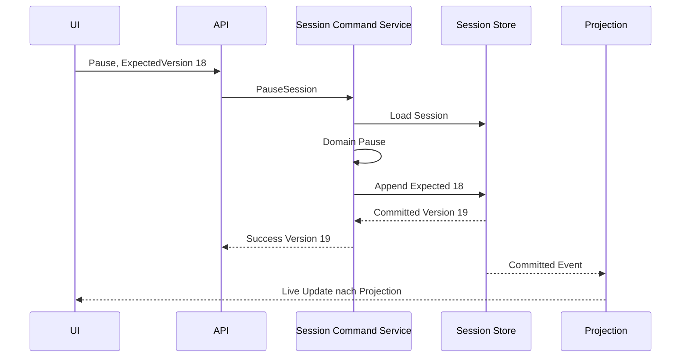
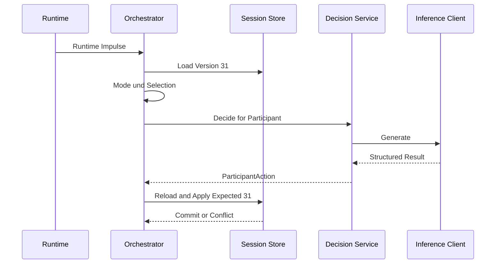

# Persona Simulation Playground

## Arbeitspaket 4B: Port- und Ablaufbeispiele

**Status:** REVIEW DRAFT  
**Version:** 1.0  
**Datum:** 2026-08-16  
**Hinweis:** Beispiele zeigen Verantwortungen und Datenfluss, keine finalen Signaturen

## 1. Zweck

Die folgenden Skizzen helfen bei der späteren C#-Modellierung. Namen, generische Parameter und Resulttypen dürfen sich in 4C ändern, solange die Verantwortungsgrenzen aus 4A erhalten bleiben.

## 2. Einheitliche event-sourced Aggregate-Persistenz

```csharp
public interface IPersonaStore
{
    Task<Persona?> LoadAsync(PersonaId id, CancellationToken ct);

    Task AppendAsync(
        Persona persona,
        long expectedStreamVersion,
        CancellationToken ct);
}
```

Interpretation:

- Port liegt in Application;
- Implementierung liegt in Infrastructure;
- Domain kennt ihn nicht;
- `expectedStreamVersion` schützt parallele Bearbeitung;
- endgültiger Resulttyp kann die committed Stream Version zurückgeben.

Da alle fachlichen Aggregate dieselbe Event-Sourcing-Semantik besitzen, darf der modernisierte Framework-Repository-Contract gemeinsam genutzt werden. Aggregate-spezifische Application Ports entstehen nur, wenn sie Fachsprache oder zusätzliche fachliche Fähigkeiten ausdrücken.

## 3. Eventgesourcte Session-Persistenz

Variante A, application-spezifischer Port:

```csharp
public interface ISessionStore
{
    Task<Session?> LoadAsync(SessionId id, CancellationToken ct);

    Task<SessionCommit> SaveAsync(
        Session session,
        long expectedVersion,
        CancellationToken ct);
}
```

Variante B:

```text
Application verwendet direkt einen modernisierten,
ausreichend sauberen DDD.BuildingBlocks Repository-Contract.
```

Entscheidungsregel:

- Variante A, wenn sie Fachsprache, Typisierung oder Testbarkeit verbessert;
- Variante B, wenn A nur Methoden ohne eigene Semantik weiterleitet.

## 4. Framework Provider SPI

Eine mögliche Zielgestalt unterhalb des Repositorys:

```csharp
public interface IEventStorageProvider
{
    Task<EventStreamSlice> ReadStreamAsync(
        StreamIdentity stream,
        long fromVersion,
        CancellationToken ct);

    Task<AppendResult> AppendAsync(
        StreamIdentity stream,
        long expectedVersion,
        IReadOnlyList<UncommittedEvent> events,
        CancellationToken ct);

    Task<EventFeedSlice> ReadFeedAsync(
        long afterGlobalPosition,
        int maxCount,
        CancellationToken ct);
}
```

Dies ist Framework-SPI und nicht Domain-API. PostgreSQL, ein externer Store oder ein Testprovider können den Contract implementieren.

## 5. Inference Port

```csharp
public interface IInferenceClient
{
    Task<InferenceResult> GenerateAsync(
        InferenceRequest request,
        CancellationToken ct);
}
```

Providerneutraler Request:

```text
ModelEndpointKey
RenderedMessages oder Prompt
StructuredOutputSchema
GenerationSettings
RequestId
Deadline
```

Nicht enthalten:

- Session Aggregate;
- Domain Events;
- HTTP Client;
- Retry Loop;
- vLLM-spezifischer Response Body.

## 6. ContextBuilder

```csharp
public interface IContextBuilder
{
    Task<BuiltContext> BuildAsync(
        TurnContext turn,
        CancellationToken ct);
}
```

```text
TurnContext
  SessionId und ExpectedVersion
  ParticipantId
  PersonaVersion
  ScenarioVersion
  InteractionModeContext
  Relationships
  ParticipantState
  HistoricalContext
  RecentEvents
  CurrentTrigger
  AllowedActions
```

`BuiltContext` enthält Context Blocks, gerenderten Request, Tokenzählung und Debuginformationen, aber keine Chain-of-Thought.

## 7. Selection Policy

```csharp
public interface IParticipantSelectionPolicy
{
    SelectionResult Select(
        SelectionContext context,
        IRandomSource random);
}
```

Der Port kann synchron bleiben, solange die MVP-Policy nur auf bereits geladenen Daten arbeitet.

```text
SelectionResult
  Selected Participant
  oder Idle
  plus Selection Trace
```

## 8. Interaction Mode

```csharp
public interface IInteractionMode
{
    ModeCode Code { get; }

    ConfigurationValidation ValidateConfiguration(...);
    AllowedActionSet DetermineAllowedActions(...);
    EligibilityResult DetermineEligibility(...);
    ModeStep EvaluateNextStep(...);
    ActionValidation ValidateAction(...);
}
```

Die Auslassungspunkte sind absichtlich. Entscheidend ist, dass diese Methoden keine Repositories oder Inference Clients benötigen.

## 9. Decision Service

```csharp
public interface IParticipantDecisionService
{
    Task<DecisionResult> DecideAsync(
        TurnContext turn,
        CancellationToken ct);
}
```

Konzeptueller Ablauf:

```text
Build Context
Call Inference
Parse Structured Output
Validate Syntax
Return ParticipantAction or classified failure
```

`DecisionResult` enthält keine Domain Events.

## 10. Runtime Ports

```csharp
public interface IActiveSessionGuard
{
    Task<GuardResult> TryAcquireAsync(SessionId sessionId, CancellationToken ct);
    Task ReleaseAsync(SessionId sessionId, CancellationToken ct);
}
```

```csharp
public interface ITurnStore
{
    Task RecordPlannedAsync(PlannedTurn turn, CancellationToken ct);
    Task MarkInferenceStartedAsync(TurnId id, CancellationToken ct);
    Task MarkCompletedAsync(TurnId id, TurnOutcome outcome, CancellationToken ct);
    Task<IReadOnlyList<RecoverableTurn>> FindInterruptedAsync(CancellationToken ct);
}
```

```csharp
public interface IRuntimeImpulseQueue
{
    ValueTask<EnqueueResult> EnqueueAsync(RuntimeImpulse impulse, CancellationToken ct);
    ValueTask<RuntimeImpulse?> DequeueAsync(CancellationToken ct);
}
```

Diese Beispiele sind noch keine Entscheidung, dass alle drei Ports getrennte Persistenzimplementierungen benötigen.

## 11. Clock, Random und Token Counter

```csharp
public interface IClock
{
    DateTimeOffset UtcNow { get; }
}

public interface IRandomSource
{
    double NextUnit();
}

public interface ITokenCounter
{
    ValueTask<TokenCount> CountAsync(
        ModelDescriptor model,
        RenderedContext context,
        CancellationToken ct);
}
```

## 12. Read Model und Live Publication

```csharp
public interface ISessionQueries
{
    Task<SessionDetailReadModel?> GetAsync(SessionId id, CancellationToken ct);
    Task<IReadOnlyList<SessionListItem>> ListAsync(CancellationToken ct);
}
```

```csharp
public interface ILiveUpdatePublisher
{
    ValueTask PublishAsync(LiveUpdate update, CancellationToken ct);
}
```

Der Publisher publiziert keine uncommitted Aggregateänderung.

## 13. Beispiel: Pause durch Benutzer



Die API wartet nicht darauf, dass ein aktuell laufender vLLM-Aufruf kooperativ endet. Der spätere Turncommit scheitert über ExpectedVersion, falls das Resultat stale ist.

## 14. Beispiel: Autonomer Participant Turn



Keine Datenbanktransaktion bleibt während `Generate` offen.

## 15. Beispiel: Projection Recovery

```text
Projection checkpoint = 500
Event 501 schlägt fehl
Checkpoint bleibt 500
Domain commits laufen weiter
Worker startet später erneut
liest ab Position 500 exklusiv
wendet Event 501 idempotent an
speichert Read Model + Checkpoint 501 atomar
```

## 16. Beispiel: Event-Store-Austausch

```text
Session Domain
     |
Application Persistence Capability
     |
DDD.BuildingBlocks Repository
     |
IEventStorageProvider
     |
     +-- InMemory Test Provider
     +-- PostgreSQL Provider
     +-- External Event Store Adapter, falls später entschieden
```

Aggregate, Commands, Events und Orchestrator ändern sich beim Providerwechsel nicht.

## 17. Beispielresultate statt Exceptions für erwartbare Ausgänge

Konzeptionell sollten Use Cases erwartbare Ausgänge typisiert zurückgeben:

```text
Success
ValidationRejected
DomainRejected
ConcurrencyConflict
NotFound
AlreadyProcessed
```

Infrastrukturdefekte und Programmierfehler bleiben davon getrennt. Die genaue Umsetzung mit Discriminated-Union-ähnlichen Records, Resulttyp oder Exceptions wird in 4C entschieden.

## 18. Abnahmekriterien für 4B

- Beispiele unterstützen die Grenzen aus 4A.
- kein Beispiel zwingt eine Event-Store-Technologie auf.
- Cancellation ist an I/O-Grenzen sichtbar.
- Domain Events entstehen nicht im Inference Adapter.
- kein Beispiel hält eine Transaktion über Inference.
- Read Models und Aggregate werden nicht vermischt.
- Beispiele bleiben klein genug, um in der Implementierung angepasst zu werden.
