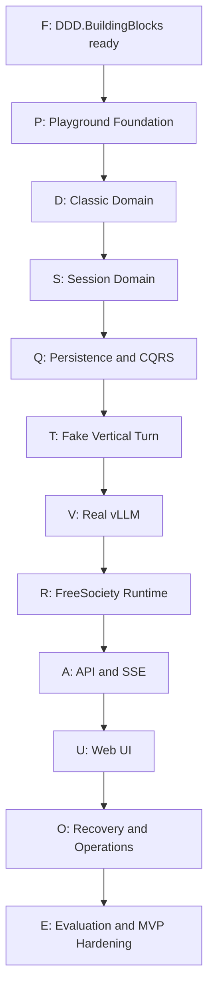

# Persona Simulation Playground

## Arbeitspaket 5: Inkrementeller Implementierungs- und Abnahmeplan

**Status:** REVIEW DRAFT  
**Version:** 1.1  
**Datum:** 2026-08-16  
**Geltungsbereich:** Reihenfolge, Abhängigkeiten, Qualitätsgates und Stop-Punkte der Implementierung

## 1. Ziel

Die Umsetzung erfolgt als Folge kleiner, einzeln verständlicher und abnehmbarer Etappen. Jede Etappe erzeugt einen technisch lauffähigen oder durch Tests belastbar prüfbaren Zwischenstand.

Dieser Plan ist absichtlich kein Satz vollständig formulierter Codex-Aufträge. Die exakte Aufgabenbeschreibung entsteht jeweils erst unmittelbar vor Beginn einer Etappe. Dadurch können Erkenntnisse aus dem vorangegangenen Code und den Tests einfließen.

## 2. Leitprinzipien

### 2.1 Kein Big Bang

Codex erhält nie den Auftrag, den gesamten Playground oder eine komplette Schicht auf einmal zu implementieren.

Jede Etappe:

- verfolgt ein begrenztes Ziel;
- besitzt explizites In Scope und Out of Scope;
- verändert möglichst nur einen fachlichen oder technischen Schwerpunkt;
- bringt automatisierte Tests mit;
- endet an einem Review- und Stop-Punkt;
- wird erst nach Sichtung fortgesetzt.

### 2.2 Lernen aus Code ist vorgesehen

Die Dokumente 3C und 4C werden während der Implementierung aktiv geführt. Wenn eine C#-Modellierung eine Schwäche der vorherigen Spezifikation zeigt, wird nicht blind an der Spezifikation festgehalten.

Der Ablauf lautet:

```text
kleine Etappe spezifizieren
Codex implementiert
Tests und Code gemeinsam prüfen
Modellentscheidung bestätigen oder korrigieren
Dokumente aktualisieren
erst dann nächste Etappe
```

### 2.3 Architektur zuerst, Produktwert früh

Die grundlegenden Architekturgrenzen und das Framework werden zuerst stabilisiert. Danach wird so früh wie möglich ein schmaler vertikaler Slice hergestellt.

Es werden nicht zunächst monatelang alle denkbaren Infrastrukturbausteine isoliert fertiggebaut. Jede technische Grundlage muss durch einen konkreten späteren Playground-Bedarf begründet sein.

### 2.4 Tests sind Teil der Modellierung

Tests dienen nicht nur der Regression. Insbesondere Domain-, Concurrency- und Projection-Tests helfen, Verträge zu präzisieren.

### 2.5 Kein stiller Scopezuwachs

Wenn während einer Etappe ein angrenzendes Feature sinnvoll erscheint, wird es als Folgepunkt notiert. Es wird nicht automatisch mitimplementiert.

## 3. Hierarchie der Planung

```text
dieser übergeordnete Implementierungsplan
        |
Etappenbrief unmittelbar vor Umsetzung
        |
Codex-Auftrag für genau eine Etappe
        |
Implementierung und Tests
        |
Review, Abnahme und Dokumentabgleich
```

Dieser Plan entscheidet die grobe Reihenfolge. Der spätere Etappenbrief entscheidet konkrete Dateien, Signaturen, Testfälle und Befehle.

## 4. Statusmodell einer Etappe

```text
PLANNED
READY FOR BRIEFING
READY FOR CODEX
IN IMPLEMENTATION
IN REVIEW
ACCEPTED
BLOCKED
SUPERSEDED
```

Nur eine fachlich größere Etappe soll gleichzeitig `IN IMPLEMENTATION` sein.

## 5. Allgemeine Definition of Ready

Eine Etappe darf an Codex übergeben werden, wenn:

- ihr Ziel in einem Satz formulierbar ist;
- Voraussetzungen erfüllt sind;
- In Scope und Out of Scope feststehen;
- betroffene Architekturentscheidungen bekannt sind;
- notwendige Verträge ausreichend präzise sind;
- Akzeptanzkriterien prüfbar sind;
- erwartete automatisierte Tests benannt sind;
- ein manueller Reviewfokus definiert ist;
- ein Stop-Punkt existiert;
- offene Entscheidungen markiert sind, die Codex nicht selbst treffen darf.

## 6. Allgemeine Definition of Done

Eine Etappe ist abgeschlossen, wenn:

- der vereinbarte Scope implementiert ist;
- Build und relevante Tests erfolgreich sind;
- keine Tests zur Umgehung eines Fehlers deaktiviert wurden;
- keine unerklärten Warnungen neu entstanden sind;
- Architekturregeln eingehalten sind;
- Dokumentabweichungen erfasst sind;
- keine unbeabsichtigten Änderungen außerhalb des Scopes enthalten sind;
- Oliver Code, Verhalten und offene Punkte gesichtet hat;
- die Etappe ausdrücklich abgenommen wurde.

## 7. Gesamtübersicht



## 8. Block F: DDD.BuildingBlocks modernisieren und freigeben

Dieser Block findet vor der eigentlichen Playground-Implementierung statt. Änderungen erfolgen im Framework-Repository und werden dort versioniert, getestet und freigegeben.

### F0: Arbeitsumgebung und Baseline

**Ziel:** Den unveränderten Frameworkstand reproduzierbar bauen und testen.

**In Scope:**

- korrekten Referenzcommit bestätigen;
- .NET SDK und Buildumgebung festlegen;
- Restore, Build und Test ausführen;
- Testgruppen und externe Voraussetzungen dokumentieren;
- bekannte Fehler und Warnungen erfassen.

**Out of Scope:** Jede semantische Änderung.

**Nachweis:** Baseline-Bericht mit Testergebnis.

**Stop-Punkt:** Über Baseline-Probleme entscheiden, bevor modernisiert wird.

### F1: .NET 10 und Projektmodernisierung

**Ziel:** Framework technisch auf .NET 10 LTS bringen, ohne bewusst die Domainsemantik zu verändern.

**In Scope:**

- Target Framework und Packages;
- zentrale Buildkonfiguration;
- Nullable und Compilerwarnungen;
- Linux-Kompatibilität;
- veraltete oder widersprüchliche Referenzen.

**Nicht automatisch In Scope:** Azure- und MSSQL-Funktionserweiterungen ohne Playground-Bedarf.

**Abnahmefokus:** Semantik unverändert, Build sauber, Tests mindestens auf Baseline-Niveau.

### F2: Taktische Typen und fokussiertes Event Sourcing

**Ziel:** Den event-sourced Aggregate Root eindeutig benennen und härten, ohne eine zweite zustandsbasierte Aggregate-Hierarchie einzuführen.

**In Scope:**

- `EventSourcedAggregateRoot<TKey>` als einziges Aggregate-Root-Modell des Frameworks;
- kein `ConventionalAggregateRoot` und kein konsumloses allgemeines `IAggregateRoot`;
- bestehender eventgesourcter Root;
- Entity, EntityId und ValueObject überprüfen;
- uncommitted Events und Replay sauber kapseln;
- Versionskonvention dokumentieren;
- Tests für Apply, Replay und Invariants.

**Stop-Punkt:** API der taktischen Typen gemeinsam prüfen. Diese API prägt später jedes Playground-Aggregate.

### F3: Event Contracts und Codec

**Ziel:** Persistierte Events von CLR- und Assemblynamen entkoppeln.

**In Scope:**

- Event Envelope;
- stabile Event-Type-Keys;
- Schema Version;
- Event Registry;
- Codec-Abstraktion;
- mindestens ein Upcasting-Beispiel;
- Zeit-, Correlation- und Causation-Metadaten.

**Abnahmefokus:** Kleine stabile fachliche Payload, technische Metadaten separat.

### F4: Async, Cancellation, DI und Fehlersemantik

**Ziel:** Kerncontracts kontrollierbar und modern integrierbar machen.

**In Scope:**

- Cancellation an I/O-Grenzen;
- explizite Handlerregistrierung;
- Service Locator aus normalen Laufzeitpfaden entfernen;
- erwartbare Konflikte von Infrastrukturdefekten unterscheiden;
- keine Cancellation in reinem Domain Apply.

### F5: Produktionsnaher In-Memory-Provider und Contract Tests

**Ziel:** Eine schnelle Testimplementierung bereitstellen, die dieselben Kerninvariants wie ein Produktprovider erzwingt.

**In Scope:**

- atomarer Expected-Version-Check;
- thread-sichere Streams;
- Event IDs und geordnete Versionen;
- Feed für Projection Tests;
- Provider Contract Test Suite;
- Given-When-Then-Testhilfen.

**Out of Scope:** Produktive Dauerpersistenz.

### F6: Persistence Decision Gate

**Ziel:** Genau einen produktiven Event-Store-Ansatz auswählen.

Optionen:

```text
PostgreSQL Provider für DDD.BuildingBlocks
Adaption der vorhandenen relationalen Providerlogik
externer Event Store mit Adapter
```

Bewertung:

- Korrektheit und Concurrency;
- globaler Projection Feed;
- Betriebsaufwand im Homelab;
- Backup und Restore;
- Ressourcenbedarf;
- Testbarkeit;
- Migrationsfähigkeit;
- Framework-Fit;
- Lock-in.

**Wichtig:** Dieses Gate darf kurz sein, muss aber bewusst stattfinden. Codex wählt die Technologie nicht nebenbei.

### F7: Produktiver Store-Adapter

**Ziel:** Den in F6 gewählten Store über die Framework-Providergrenze anbinden.

**Mindestnachweise:**

- Create Stream;
- Multi-Event Append;
- Expected-Version-Conflict;
- paralleler Append;
- vollständiger Replay;
- Feed ab globaler Position;
- reproduzierbare Konfiguration oder Migration;
- Integrationstests gegen echten Store.

### F8: Projection Checkpoints und Rebuild

**Ziel:** Eine belastbare Projection-Grundlage im Framework bereitstellen.

**In Scope:**

- Checkpoint pro Projection und Version;
- idempotente Zustellung;
- transaktionaler Read-Model-/Checkpoint-Fortschritt, soweit der gewählte Store dies ermöglicht;
- isolierter Projection-Fehler;
- inkrementelle Recovery;
- vollständiger Rebuild.

### F9: Snapshot-Härtung

**Ziel:** Snapshots als optionale und verwerfbare Optimierung absichern.

Diese Etappe darf verschoben werden, wenn Messungen zeigen, dass Snapshots für den ersten Slice nicht benötigt werden. Die Contracts dürfen den späteren Einsatz aber nicht verhindern.

### F10: Framework Release Gate

**Ziel:** Framework für den Playground freigeben.

**Erforderlich:**

- Frameworktests grün;
- Produktprovider-Contract-Tests grün;
- Linux-Build;
- API-Dokumentation;
- Version und Package/Project-Referenz festgelegt;
- kleines Beispiel für Plain und ES Aggregate;
- keine kritischen Findings offen.

**Stop-Punkt:** Oliver nimmt das Framework ausdrücklich als `READY FOR PLAYGROUND` ab.

## 9. Block P: Playground Foundation

### P0: Repository und Solution Skeleton

**Ziel:** Kleinste kompilierbare Solution mit den verbindlichen Schichtgrenzen.

```text
PersonaPlayground.Api
PersonaPlayground.Application
PersonaPlayground.Domain
PersonaPlayground.Infrastructure
Tests
```

Noch keine Fachlogik und keine vorsorglichen Zusatzprojekte.

### P1: Architekturtests

**Ziel:** Dependency Direction maschinell schützen.

Nachweise:

- Domain ohne API, Infrastructure, EF, HTTP und vLLM;
- Application abhängig von Domain und erlaubten Frameworkcontracts;
- Infrastructure implementiert Application-/Framework-Ports;
- API enthält Composition und Transport, keine Geschäftslogik.

### P2: Technische Minimalbasis

**Ziel:** Konfiguration, Logging, Fehlerkorrelation und Teststruktur bereitstellen.

Nicht enthalten: vollständige Observability-Plattform, Kubernetes oder UI.

## 10. Block D: Verwaltete Domain Aggregate

### D0: Starke IDs und gemeinsame Value Objects

Nur die für die nächsten Aggregate benötigten Typen. Keine vollständige hypothetische Shared-Kernel-Sammlung.

### D1: Persona und PersonaVersion

**Nachweise:**

- Create mit initialer Version;
- neue immutable Version;
- Archivierung;
- TraitValue-Validierung;
- Expected Stream Version im Application-Slice.

**Stop-Punkt:** 3C und 4C aktualisieren.

### D2: Psychological und Communication Profile

**Ziel:** Strukturierte Profile fachlich validieren, noch ohne Prompt Rendering.

### D3: Scenario und ScenarioVersion

**Nachweise:** Versionierung, Archivierung und historische Referenzierbarkeit.

### D4: PersonaRelationship Baseline

**Nachweise:** gerichtete Eindeutigkeit, neutrale Defaults, keine automatische Sessionrückwirkung.

### D5: Event-Stream-Persistenzintegration der verwalteten Aggregate

**Ziel:** Die gewählte Event-Store-Implementierung für Persona, Scenario und PersonaRelationship verwenden und ihre Read Models projizieren.

Dies kann pro Aggregate inkrementell erfolgen. Es soll keine parallele universelle CRUD-Write-Infrastruktur entstehen.

## 11. Block S: Session Domain

### S0: Session Skeleton und Created Event

Kleinster eventgesourcter Root mit Rehydrationstest.

### S1: Konfiguration und `CanStart`

Scenario-, Mode- und Runtime-Referenzen sowie berechnete Startfähigkeit. Kein persistierter `READY` State.

### S2: Lifecycle

```text
DRAFT
RUNNING
PAUSED
COMPLETED
ABORTED
```

Given-When-Then-Tests für alle erlaubten und verbotenen Übergänge.

**Stop-Punkt:** Lifecycle fachlich abnehmen.

### S3: Participants und PersonaVersion-Bindung

- Add/Remove in Draft;
- keine doppelte Persona;
- immutable Version nach Start;
- initialer Participant State.

### S4: Session Relationships

- gerichtete Zustände;
- Initialisierung aus Baseline oder Default;
- historische Stabilität;
- noch keine automatische dynamische Evaluation.

### S5: Human Message und Scenario Event

Fachliche Trennung von sichtbarem Human Input und administrativen Commands.

### S6: ParticipantAction Mapping

Zunächst:

```text
Speak
DoNothing
```

Danach bei tatsächlichem Slice-Bedarf:

```text
React
Enter
Leave
```

### S7: Event Contract Consolidation

3B und 3C werden anhand der implementierten Events konsolidiert. Erst danach gilt der Session-Kern als stabil genug für Runtime-Arbeit.

## 12. Block Q: CQRS und produktive Persistenzintegration

### Q0: Session Repository/Store Integration

**Ziel:** Session über das freigegebene Framework und den gewählten Produktprovider speichern und rehydrieren.

Hier wird endgültig entschieden, ob Application direkt den Framework-Repository-Contract nutzt oder ein fachlicher `ISessionStore` sinnvoll ist.

### Q1: Optimistic Concurrency

**Nachweise:**

- parallele Commands;
- stale Expected Version;
- Multi-Event Commit;
- keine teilweise gespeicherten Eventbatches.

### Q2: Erstes Session Read Model

Minimaler Sessionstatus für Query und spätere UI.

### Q3: Event Feed Read Model

Geordnete, darstellbare fachliche Events ohne UI-Semantik in den Domain Events.

### Q4: Projection Idempotency und Recovery

Fehler, Retry, Prozessneustart und vollständiger Rebuild.

### Q5: Persist-before-publish

Nachweis, dass Live-Signale niemals uncommitted oder noch nicht lesbaren Zustand behaupten.

## 13. Block T: Erster vertikaler Turn ohne echtes LLM

### T0: Interaction-Mode-Abstraktion und Test Mode

Noch keine vollständige FreeSociety-Policy. Zunächst nur der Erweiterungspunkt und ein Test Double.

### T1: Deterministische Participant Selection

Kleiner Selection Context, Seeded Random Source und Selection Trace.

### T2: Minimaler ContextBuilder

Deterministische Blöcke für eine Persona, ein Scenario und Recent Events. Noch keine komplexe Compaction.

### T3: Fake Decision Service

Liefert kontrolliert `Speak` oder `DoNothing`.

### T4: Ein manueller Runtime-Impuls

```text
Session laden
Eligibility bestimmen
Participant auswählen
Context bauen
Fake Action erzeugen
Action validieren
Event committen
Read Model projizieren
```

### T5: Stale-Turn- und Human-Priority-Test

Während eines künstlich verzögerten Turns pausiert der Human die Session. Das alte Resultat darf nicht committen.

**Gate:** Erster echter vertikaler Domain-/Application-/Persistence-Slice ist abgenommen.

## 14. Block V: Reale vLLM-Inference

### V0: Providerneutraler Inference Contract

Nur die tatsächlich vom Slice benötigten Request- und Resultdaten.

### V1: vLLM Adapter

- konfigurierbarer Endpoint;
- Auth/Headers aus sicherer Konfiguration;
- Timeout und Cancellation;
- keine Domainobjekte im Transport;
- strukturierte Antwort.

### V2: ParticipantAction Parsing

Syntaktische Validation, klassifizierte Fehler und begrenzter Korrekturversuch.

### V3: One-Call Decision and Generation

WHAT und HOW in einem MVP-Request, ohne die konzeptuelle Trennung aufzugeben.

### V4: Kontext- und KV-Cache-Korrektheit

Nachweise:

- Request vollständig rekonstruierbar;
- Cache Miss ändert keine Fachsemantik;
- Neustart von vLLM verliert keinen Domain State;
- Prefix-Struktur bleibt stabil.

## 15. Block R: FreeSociety Runtime

### R0: Eligibility und Allowed Actions

Mode-spezifisch, aber ohne LLM-Auswahl.

### R1: Behavioral Activation Policy

Schrittweise Inputs hinzufügen:

- Direct Address;
- Event Relevance;
- Relationship Relevance;
- Recency Penalty;
- ausgewählte Traits;
- Candidate Threshold.

Nicht alle Gewichte gleichzeitig einführen. Jede Erweiterung benötigt deterministische Tests.

### R2: Weighted Selection und Monopolization Guard

Seedbare Auswahl, Consecutive Turn Limit und nachvollziehbarer Trace.

### R3: Idle und DoNothing

Kein erzwungenes Sprechen und kein sofortiges Re-Rolling bis jemand spricht.

### R4: Manual Step Mode

Exakt ein Orchestrierungsschritt pro Benutzerkommando.

### R5: Kontrollierter Auto Mode

Bounded Queue, höchstens ein Folgeimpuls, global ein Inference Slot.

### R6: Runtime Cancellation und Recovery State

Pause, Abort, Timeout, fehlgeschlagener Turn und Prozessneustart.

## 16. Block A: API und Live Transport

### A0: Command-Endpunkte

Transport-Mapping für bereits vorhandene Use Cases. Keine Fachlogik im API-Projekt.

### A1: Query-Endpunkte

Read Models, keine Aggregate.

### A2: Login und Single-User-Schutz

- genau eine konfigurierte Benutzeridentität;
- sichere Credentials;
- Cookie oder gleichwertiger Browsermechanismus;
- CSRF-Schutz;
- keine anonymen Fach- oder SSE-Endpunkte.

### A3: SSE

Sessionbezogene Streams, Reconnect und Replay ab Cursor.

### A4: Mehrere Tabs und Concurrency UX

Zweiter Tab sieht denselben Serverzustand. Veraltete Commands liefern verständliche Konflikte.

## 17. Block U: Web UI

Arbeitspaket 7 definiert Anforderungen, Kandidaten und Entscheidungskriterien. Die konkrete UI-Technologie wird vor Beginn der produktiven UI-Etappen durch einen kleinen Vergleichsspike und ein ausdrückliches Gate entschieden.

### U0: Shell, Login und Navigation

### U1: Persona-, Scenario- und Relationship-Verwaltung

Kann schrittweise pro Aggregate entstehen.

### U2: Session-Konfiguration

Versionen explizit auswählen, Startfähigkeit anzeigen.

### U3: Session Player

Event Feed, Personaunterscheidung und serverseitiger Status.

### U4: Human Control

Start, Pause, Resume, Step, Complete, Abort, Human Message und Scenario Event.

### U5: Debug Views

Selection Trace, Context Blocks, Runtimestatus und verständliche Fehler. Keine Chain-of-Thought-Anzeige.

## 18. Block O: Recovery, Betrieb und Deployment

### O0: Health Model

Liveness, Readiness und Dependency Health getrennt.

### O1: Interrupted Turn Recovery

Kein ungeprüftes Auto-Resume. Benutzer kann fortsetzen, pausieren oder abbrechen.

### O2: Projection Administration

Lag, Retry und Rebuild sichtbar und kontrollierbar.

### O3: Container Build

Erst nach lokal funktionierendem vertikalem Slice.

### O4: k3s Deployment

- Application Pod;
- PostgreSQL beziehungsweise gewählter Event Store;
- Secrets;
- Ingress/HTTPS;
- vLLM Endpoint;
- persistente Volumes;
- Backup und Restore.

### O5: Restart- und Failure-Tests

Application, Datenbank/Event Store und vLLM kontrolliert neu starten und Recovery prüfen.

## 19. Block E: Evaluation und MVP-Härtung

### E0: Drei-Persona-Fixtures

Deutlich unterscheidbare Persona-Versionen und ein versioniertes FreeSociety-Scenario.

### E1: Technische Regression

Architektur-, Domain-, Projection-, Runtime-, Context- und Restart-Tests.

### E2: Behavioral Baseline

- Persona Identity;
- Classification;
- Context Persistence;
- Relationship Sensitivity;
- Persona Collapse Detection.

### E3: Runtime- und Cache-Benchmarks

Prompt Tokens, Cached Tokens, Prefill, TTFT, Gesamtdauer und `A-B-C-A`.

### E4: MVP-Abnahmeszenario

Das vollständige Szenario aus dem verbindlichen MVP-Scope wird manuell und soweit möglich automatisiert geprüft.

### E5: Hardening und Scopeabschluss

Offene MUST-Anforderungen schließen, SHOULD bewusst entscheiden, LATER und NOT NOW bestätigen.

## 20. Empfohlene Abnahmegates

| Gate | Nachweis | Darf danach beginnen |
|---|---|---|
| G0 Framework Baseline | unveränderter Stand reproduziert | Frameworkmodernisierung |
| G1 Tactical Core | Aggregate- und Eventbasis abgenommen | Provider und Playground Foundation |
| G2 Framework Ready | Produktprovider und Kernprüfungen abgenommen | Playground auf Framework |
| G3 Classic Domain | Persona, Scenario, Relationships stabil | Sessionkonfiguration |
| G4 Session Domain | Lifecycle, Participants und Actions stabil | produktive CQRS-Integration |
| G5 CQRS Ready | Persistenz, Projection und Recovery | vertikaler Turn |
| G6 Fake Vertical Slice | kompletter Turn ohne LLM | echter vLLM Adapter |
| G7 Inference Ready | strukturierte echte Inference stabil | FreeSociety Auto Runtime |
| G8 Backend MVP | Runtime, API, SSE und Recovery | vollständiges UI/Deployment |
| G9 Vertical Product | UI und k3s nutzbar | Behavioral Abnahme |
| G10 MVP | Scope-Abnahmeszenario bestanden | Post-MVP-Planung |

## 21. Parallelisierung

Parallelisierung wird sparsam eingesetzt.

Sinnvoll parallel:

- UI-Skizzen, während Backend-Verträge stabil werden;
- Behavioral Fixtures, während technische Runtime entsteht;
- Dokumentation und Testdaten;
- Read-only Recherche.

Nicht sinnvoll parallel:

- Framework-Core und davon abhängige Playground-Aggregate;
- Session Contracts und Session Implementierung ohne Review;
- Eventstore und Projection-Semantik unabhängig voneinander;
- Runtime und Interaction Mode, solange Verantwortungen ungeklärt sind;
- mehrere Codex-Agenten an denselben Kernverträgen.

## 22. Umgang mit Rückschritten

Wenn eine Etappe eine falsche Annahme zeigt:

1. Arbeit an Folgeetappen stoppen.
2. Befund in 3C, 4C oder einem ADR festhalten.
3. kleinste betroffene Vertragsebene korrigieren.
4. Tests ergänzen, die den Befund reproduzieren.
5. nur betroffene Etappen neu planen.
6. keine großflächige Neugenerierung anstoßen.

## 23. Umfang eines späteren Codex-Auftrags

Der konkrete Auftrag soll später ungefähr enthalten:

```text
Etappen-ID und Ziel
aktueller Ausgangsstand
verbindliche Dokumente und Entscheidungen
In Scope
Out of Scope
betroffene Projekte
Akzeptanzkriterien
erforderliche Tests
manuelle Prüfpunkte
bekannte offene Entscheidungen
Stop-Anweisung
```

Noch nicht erforderlich sind heute:

- exakte Dateiliste jeder späten Etappe;
- endgültige Signaturen;
- vollständige Testmethodennamen;
- jeder Shellbefehl;
- detaillierte Prompts für alle zukünftigen Codex-Turns.

Diese Details würden durch spätere Erkenntnisse ohnehin veralten.

## 24. Empfohlener erster tatsächlicher Codex-Auftrag

Der erste Implementierungsauftrag betrifft nicht den Playground, sondern ausschließlich:

```text
F0: DDD.BuildingBlocks Baseline reproduzieren
```

Er darf noch keine Modernisierung enthalten. Zuerst muss bekannt sein, ob der aktuelle Commit sauber baut, welche Tests tatsächlich laufen und welche Fehler bereits vorher existieren.

Erst der zweite Auftrag beginnt mit F1.

## 25. Abnahmekriterien für Arbeitspaket 5

- Frameworkmodernisierung steht vor der Playground-Implementierung.
- Frameworkarbeit ist selbst in kleine abnehmbare Schritte geteilt.
- Event-Store-Technologie wird an einem expliziten frühen Gate entschieden.
- Domain, Application, CQRS, Inference, Runtime, API, UI und Betrieb werden nicht in einer Etappe vermischt.
- ein vertikaler Fake-Turn entsteht vor echter vLLM-Integration.
- ein lokaler vertikaler Slice entsteht vor Containerisierung und k3s.
- jede größere Phase endet mit einem Gate und Stop-Punkt.
- spätere Codex-Aufträge können just-in-time präzisiert werden.
- der Plan erlaubt Korrekturen, ohne das Gesamtprojekt neu zu starten.
